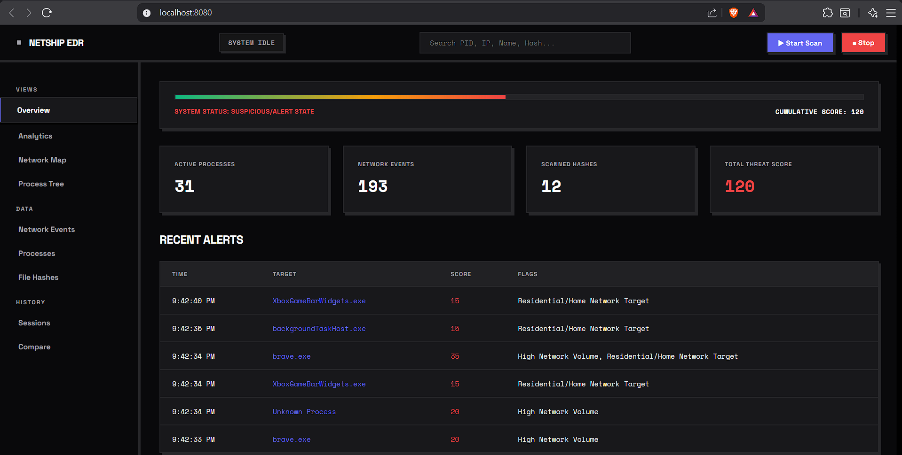
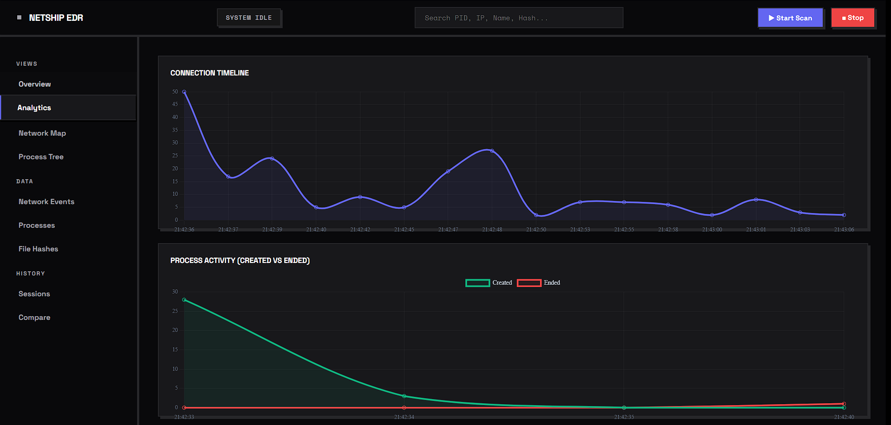
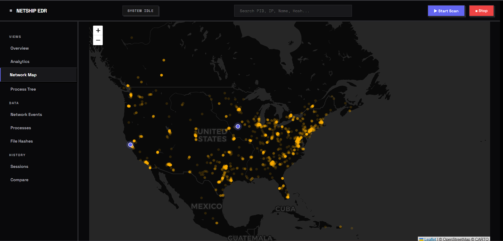
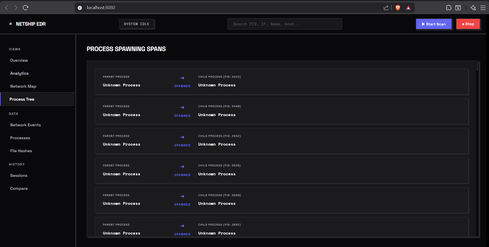
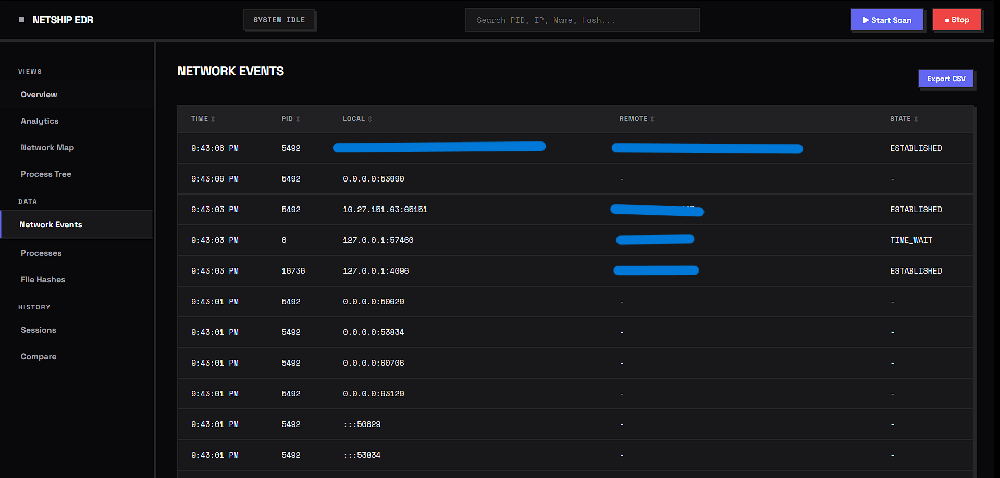
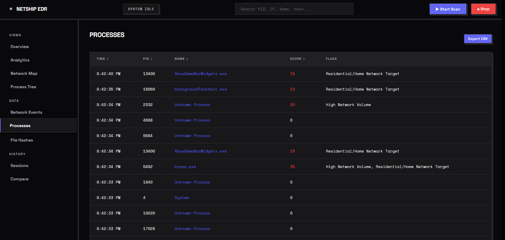
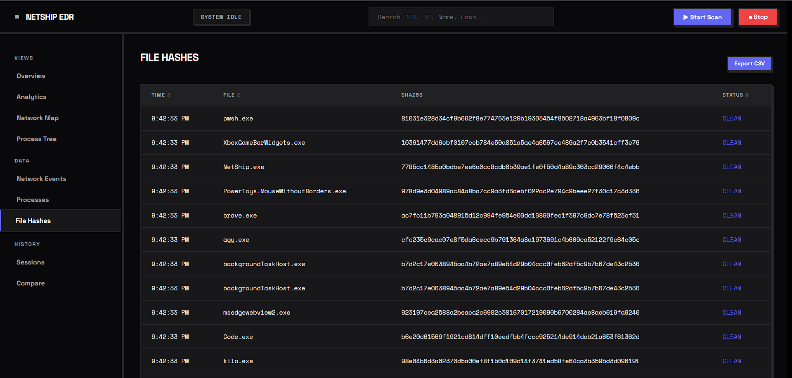

# NetShip EDR

NetShip is a local host monitoring utility and security auditing tool. It captures socket activity, profiles process lifecycles, and correlates real-time telemetry to flag suspicious behavior. NetShip embeds a dark-mode web dashboard featuring live geospatial traffic mapping, process lineage trees, port analytics, and historic session drift comparison.

---

## Technical Features

* **Real-Time Network Telemetry:** Polls active TCP/UDP sockets (IPv4 and IPv6) capturing state transitions, local/remote endpoints, and connection directionality.
* **Process Lineage Profiling:** Maps process lifecycles, child execution dependencies, execution paths, execution vital signs, and user contexts.
* **Threat Feed Correlator:** Audits active binaries using SHA256 hashing. Hashes are cross-referenced with a local malicious signature database and matched dynamically against the public **ThreatFox (Abuse.ch)** API.
* **Geospatial Mapping & Cloud Detection:** Geolocates outbound IP targets relative to datacenter catalogs and checks external traffic routes against known cloud CIDR blocks.
* **Reverse DNS Resolution:** Automatically resolves target IPs to reverse DNS hostname profiles.
* **Data Exporters:** Supports CSV table exports for network telemetry, processes lifecycle tables, and file signature hashes directly from the UI.

---

## Dashboard Anatomy

### 📊 Overview
A real-time system threat gauge displaying cumulative risk metrics and a security alerts ledger.


### 📈 Analytics
Visual connection timelines, port distributions, protocol ratios, and process execution churn charts.


### 🗺️ Network Map
A geospatial Leaflet-based visualization connecting active socket endpoints to datacenter profiles.


### 🌿 Process Tree
Relational node trees illustrating parent-child process dependencies (e.g. shells spawned from system services).


### 🌐 Network Events
Logs socket lifecycle transitions and network connections.


### ⚙️ Processes
Logs process registry states and threat alerts.


### 🔑 File Hashes
Stores computed hash audit results and local malware database check details.


### 📂 Sessions & Diff Matrix
Historical scan log database with a side-by-side session comparison tool to isolate process drift between different runs.

---

## Getting Started

### Prerequisites

* Go 1.26 or higher
* Active internet connection (on initial scan to retrieve threat signatures and cloud CIDR datasets)

### Installation & Run

1. **Get dependencies:**
   ```bash
   go mod download
   ```

2. **Build NetShip:**
   ```bash
   go build -o NetShip.exe .
   ```

3. **Run the Dashboard:**
   ```bash
   ./NetShip.exe server
   ```
   Open `http://localhost:8080` in your web browser.

---

## CLI Options

| Option / Arg | Example | Description |
| :--- | :--- | :--- |
| `server` | `NetShip.exe server` | Starts HTTP API server and web portal (default port: `:8080`). |
| `scan` | `NetShip.exe scan` | Launches background process & network telemetry loop directly. |
| `:PORT` | `NetShip.exe :9090` | Starts the server on a custom port address. |

---

## Telemetry Layout

### Historic Session Logs
Telemetry is serialized into JSON Lines (JSONL) format in the `data/` subdirectory, grouped by timestamp session ID (`data/<YYYYMMDD_HHMMSS>/`):
* `network.jsonl`: Captures socket state logs (`OPEN`, `CLOSED`).
* `processes.jsonl`: Logs process startup events and computed risk evaluations.
* `children.jsonl`: Captures parent-to-child lineage relationships.
* `geolocation.jsonl`: Stores resolved IP coordinates and carrier ISPs.
* `threat_hashes.jsonl`: Saves binary hash signature status evaluations.

### Resource Feeds
Fetched and cached in the `resources/` subdirectory on first boot:
* `malicious_hashes.txt`: Local malware signature database.
* `datacenters.json`: Global cloud service provider datacenter profile database.
* `ipv4_merged.txt` / `ipv6_merged.txt`: Aggregated cloud provider CIDR blocks.

---

## License

NetShip is released under the MIT License.

